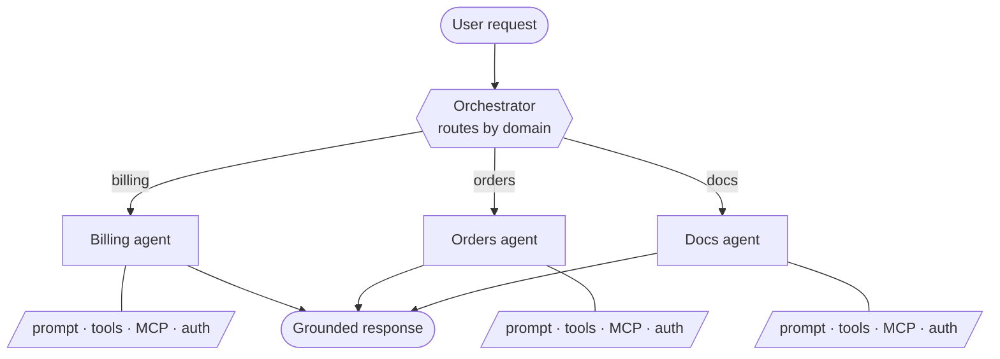

<p align="center">
  <picture>
    <source media="(prefers-color-scheme: dark)" srcset=".github/assets/logo-dark.svg">
    
  </picture>
</p>

<h1 align="center">Make your product queryable.</h1>

<p align="center">
  Turn the APIs, tools, and business logic you already have into a secure AI
  interface inside your product.
</p>

<p align="center">
  <a href="https://docs.extra-ai.co/docs/introduction"></a>
  
  <a href="LICENSE"></a>
</p>

<p align="center">
  <a href="#quick-start">Quick Start</a> ·
  <a href="#why-extra">Why Extra</a> ·
  <a href="#who-is-extra-for">Who it's for</a> ·
  <a href="https://docs.extra-ai.co/docs/introduction">Documentation</a> ·
  <a href="#contributing">Contributing</a>
</p>

---

Your users shouldn't have to learn your UI to get an answer out of it.

Extra lets them ask questions and trigger actions using the APIs and business
logic you already built.

Define the system in YAML. Extra handles routing, orchestration, and access
boundaries while your logic and credentials stay in your backend.

## Why Extra

**Ship faster.** Define your agent system instead of rebuilding routing,
streaming, tool execution, and tracing.

**Reuse your backend.** Connect the APIs, services, and business logic you
already have.

**Keep access control outside the model.** Authorization runs in trusted code —
the model cannot grant itself access to protected capabilities.

**Avoid model lock-in.** Switch model providers through configuration rather
than rewriting your product.

**Embed it in your product.** Serve the system as an API or as an embeddable
chat component.

## Quick Start

You need Docker and an API key for your model provider.

Create `agents.yml` — a single agent is a complete system:

```yaml
system:
  name: "Support Bot"

defaults:
  model:
    provider: anthropic
    name: claude-sonnet-4-6

agents:
  support_agent:
    description: "Answers questions about orders and returns."
    prompts:
      system: "prompts/support.md"

graph:
  support_agent:
```

Write the prompt it references, in `prompts/support.md`:

```markdown
You are a support agent for an online store. Answer questions about orders
and returns.
```

Run it:

```bash
docker run -p 8090:8090 -v "$(pwd):/workspace" -w /workspace \
  -e ANTHROPIC_API_KEY=sk-... \
  ghcr.io/extra-org/extra:latest serve --config agents.yml
```

Your system is live at `http://localhost:8090` — send it a message with
`POST /invoke`.

Tools, MCP servers, routing between agents, conversation history, and the chat
widget are covered in the
[Quickstart](https://docs.extra-ai.co/docs/quickstart).

## Features

- YAML-defined agents and routing
- Local Python tools and remote MCP servers
- Per-node authorization
- Human-in-the-loop tool approvals
- Anthropic, OpenAI, Gemini, and Bedrock
- Streaming API
- Structured logs and Langfuse tracing
- Embeddable web component

## Architecture

An orchestrator routes each request; focused agents do the domain work. Each
agent is scoped to its own prompt, tools, and domain data, which keeps answers
grounded in the right part of your business.



Extra runs the graph. Your project's plugins hold the trusted business logic —
tools, access checks, and the values resolved into prompts.

- **[Tutorial](https://docs.extra-ai.co/docs/tutorial)** — build a complete multi-agent system step by step.
- **[YAML reference](https://docs.extra-ai.co/docs/yaml-spec)** — every field you can declare.
- **[Architecture](https://docs.extra-ai.co/docs/architecture)** — how routing and execution work.
- **[`examples/`](examples/)** — runnable specs, including an enterprise knowledge assistant.

## Who is Extra for?

Extra is built for teams adding an AI interface to:

- Existing SaaS products
- Internal enterprise systems
- Customer support workflows
- Multi-step business operations
- Multi-tenant products with strict access boundaries

### Extra may be unnecessary if

- You need a single prompt with a few simple tools.
- You are building a chatbot with no product or backend integration.
- You need full low-level control over the orchestration runtime.
- Your workload is primarily batch or offline processing.

## Contributing

This repository is **agent-first** — if you're an AI coding agent, read
[AGENTS.md](AGENTS.md) before making changes. Human contributors should
start there too, then run `make check` before opening a PR.

## License

[MIT](LICENSE)
